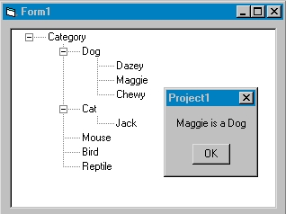



## TreeViewEasy\.zip

### Description

It's a treeview example that I created to help simplify this component. Everyone I found got in too deep for my skill level or was never completely finished. So, I created this. One form, one database. Easy.
 
### More Info
 

             |
---                |---
**Submitted On**   |2002-06-06 14:59:26
**By**             |[BlaiseMan](https://github.com/Planet-Source-Code/PSCIndex/blob/master/ByAuthor/blaiseman.md)
**Level**          |Beginner
**User Rating**    |5.0 (25 globes from 5 users)
**Compatibility**  |VB 6\.0
**Category**       |[Coding Standards](https://github.com/Planet-Source-Code/PSCIndex/blob/master/ByCategory/coding-standards__1-43.md)
**World**          |[Visual Basic](https://github.com/Planet-Source-Code/PSCIndex/blob/master/ByWorld/visual-basic.md)
**Archive File**   |[TreeViewEa91080662002\.zip](https://github.com/Planet-Source-Code/blaiseman-treevieweasy-zip__1-35547/archive/master.zip)

